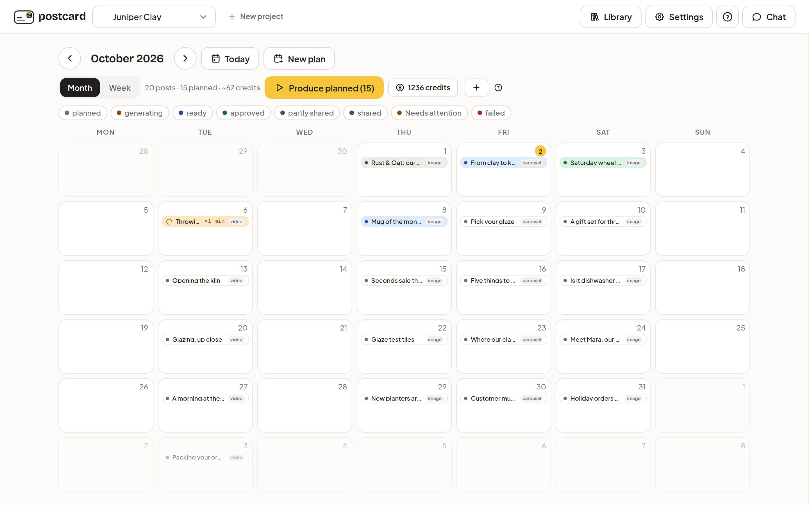
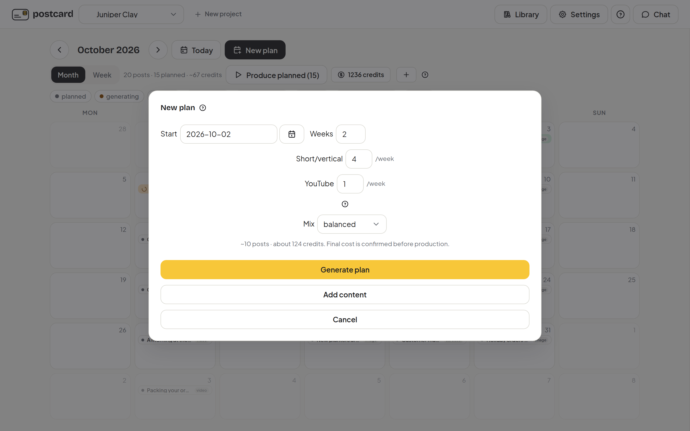
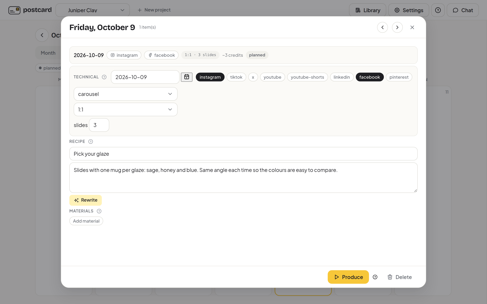
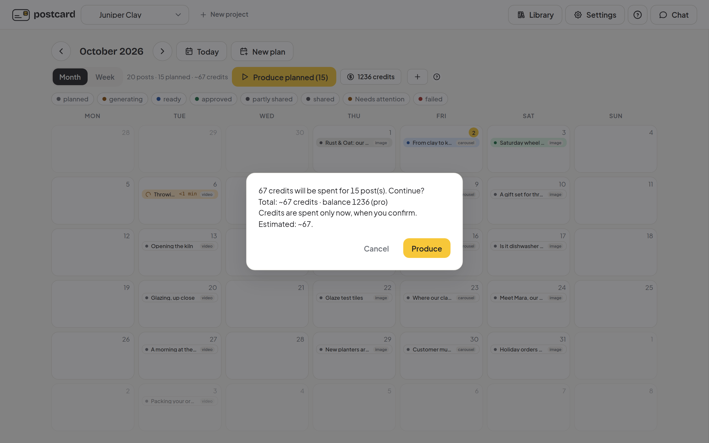
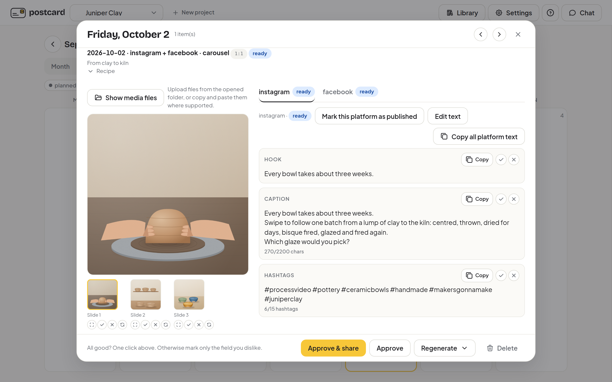
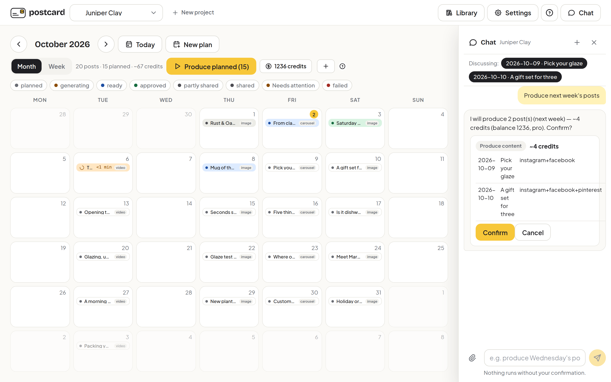
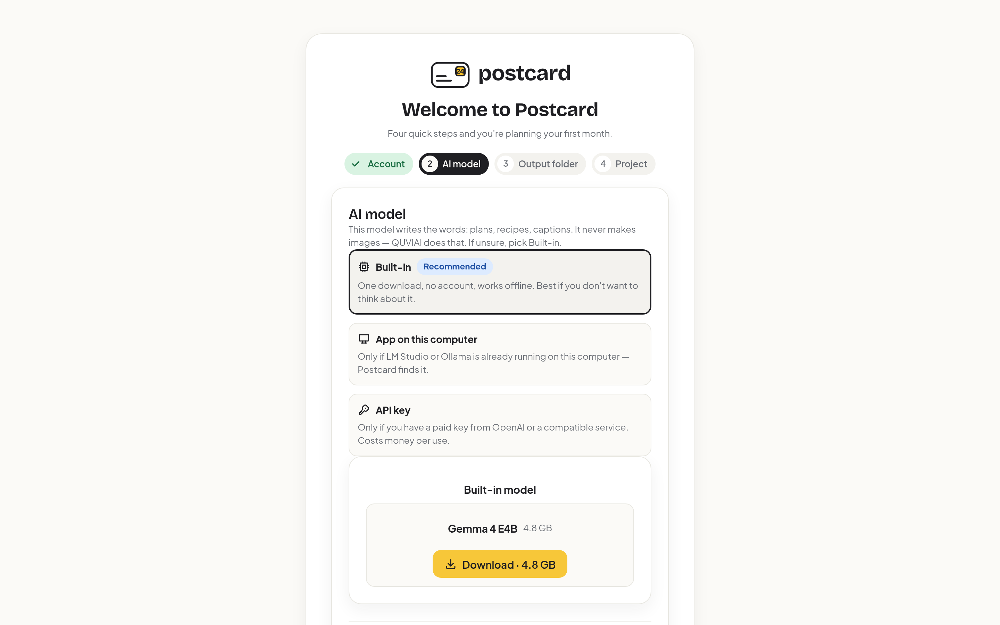

<p align="center">
  
</p>

# Postcard

**A month of social media posts, planned and written for you, then turned into images and videos when you say so.**

**With the recommended built-in AI, planning and writing run on your computer, even offline. Images and videos are made in the cloud by QUVIAI, and only after you press Produce and confirm.**

[Download Postcard](https://github.com/quvi-ai/postcard/releases/latest) for Windows, macOS or Linux.

---

## What is Postcard

Postcard is a desktop app for people who run a business and don't have time to be a social media team. Tell it about your business once: it fills your calendar with a few weeks of post ideas and writes the text for each channel, and when you approve, QUVIAI makes the visuals. You can change any idea, redo any part, and nothing is shared until you say so.

It works for Instagram, Facebook, TikTok, Pinterest, LinkedIn, X, YouTube and YouTube Shorts.

---

## What you can do with it

Plan, edit the recipe, produce, approve, or just ask in chat:

### Get a plan, not a blank page

Answer a few questions about your business, pick how often you want to post and whether you prefer more photos or more video. Postcard drafts a few weeks of posts and puts them on your calendar. Drafts are free, so you can change, move or delete them before anything is made.



### Every post is a short recipe you can edit

Each post starts as a few plain sentences: what is on screen, who or what is in it, the mood. Edit the words, press **Rewrite** for a fresh idea, or drag the post to another day. Add your logo, products and people to the library once and mention them by name, and Postcard uses the real thing instead of inventing one.



### See the cost before anything is made

Images and videos are made by QUVIAI in the cloud and use credits from your QUVIAI account. Planning, recipes, captions and chat are free. Postcard shows you the exact cost and your balance first, and waits for your OK. Nothing is spent in the background.



### You have the last word

When a post is ready, look at the images and read the text for each channel. Approve it in one click, or mark only the part you don't like, such as one slide or one caption, and Postcard redoes just that part. Copy the text and open the folder with the files when you're ready to post. Postcard never posts for you.



### Or just ask

Open **Chat** and say what you want in plain words: "produce next week's posts", "how many credits do I have?", "make the Instagram text of the last post warmer". Postcard shows you what it is about to do and what it costs, and does nothing until you press **Confirm**.



### Also included

- **Your logo on every post**, as a small watermark and a short closing card on videos, at no credit cost.
- **Your brand rules followed** in plans, recipes and captions once you add a brand or style document.
- **Your own videos**: Postcard writes the captions, hashtags and thumbnail without making anything new, at no credit cost.
- **Text that fits each channel**, with character and hashtag counts per platform.
- **Your language**: the app speaks English, German, French and Turkish, and posts can be written in your customers' language.
- **Updates only when you agree.**

---

## Private by design: the writing AI runs on your computer



During setup you choose the AI model that writes your text. The recommended choice is **Built-in**: a model that **runs on your own computer**. It is a one-time download (about 4.8 GB), needs no account, and plans and writes even when you are offline. It thinks up your plan, writes your recipes and captions, and answers you in chat. It does not make images or videos; QUVIAI does that, as described below.

What Built-in means for you:

- **Your business stays on your machine.** Your projects, plans, recipes, captions, chat history and library are stored on your computer, not on someone else's server.
- **Your finished posts are ordinary files.** Every image, video and caption is saved to a folder you choose, so you can back it up, move it or delete it like any other file.
- **No hidden sharing.** The only time content leaves your computer is when you press **Produce**: the description of that post's images or video, plus any product photos or faces it uses, is sent to QUVIAI so the visuals can be made. You confirm every time.

**Other options, only if you need them.** Setup also offers two alternatives to Built-in. You can use LM Studio or Ollama if one is already running on your computer, and your text then still stays on your machine. Or you can enter a key for a paid AI service, in which case your text is sent to that service.

---

## Download

Get the latest version from the **[Releases page](https://github.com/quvi-ai/postcard/releases/latest)**.

| Your computer | File to download |
| --- | --- |
| **Windows** 10 or 11 (64-bit) | `Postcard_<version>_x64-setup.exe` (or the `.msi` installer) |
| **macOS** 11 or newer, Apple silicon (M1 or later) | `Postcard_<version>_aarch64.dmg` |
| **Linux**, Ubuntu, Debian and similar | `Postcard_<version>_amd64.deb` |
| **Linux**, any other 64-bit distribution | `Postcard_<version>_amd64.AppImage` |

---

## System requirements

- **Windows** 10 or 11, 64-bit; **macOS** 11 Big Sur or newer on Apple silicon (Intel Macs are not supported); or **64-bit Linux** (Ubuntu 22.04 or newer for the `.deb`).
- **Memory:** 8 GB of RAM at minimum; 16 GB recommended for the built-in AI model. On slower machines, writing a post can take several minutes.
- **Disk space:** about 6 GB free for the app and the built-in AI model, plus room for your finished posts.
- **Internet:** needed to sign in, to download the built-in model once, and to make images and videos. Planning and writing work offline with the built-in model.
- **A QUVIAI account** with credits to make images and videos. You can sign in with email or Google during setup. Your password is never stored.

### Install on Windows

1. Download the `-setup.exe` file and open it.
2. If Windows shows "Windows protected your PC", click **More info**, then **Run anyway**. This appears because the installer is not yet code-signed.
3. Open **Postcard** from the Start menu.

### Install on macOS

1. Download the `.dmg` file and open it.
2. Drag **Postcard** into your **Applications** folder.
3. Open Postcard from Applications.

### Install on Linux

With the `.deb` package (Ubuntu, Debian and similar):

```
sudo apt install ./Postcard_<version>_amd64.deb
```

Then open **Postcard** from your app menu.

With the AppImage (other distributions):

```
chmod +x Postcard_<version>_amd64.AppImage
./Postcard_<version>_amd64.AppImage
```

### First start

A short setup walks you through four steps: sign in to your QUVIAI account, choose the AI model that writes your text (pick **Built-in** if you're unsure), choose a folder for your finished posts, and create your first project. Then press **New plan**.

### Updates

Windows, macOS and AppImage installs update in place after you approve. If you installed the `.deb` package, Postcard links you to the new package so you can install it the same way as before.

---

## License notices

Every installer includes FFmpeg (with ffprobe), built from source with GPL-licensed components. Each release provides the corresponding source code and license notices in `ffmpeg-gpl-source.tar.gz`.

This repository holds the downloadable builds and this page. Credits and accounts are managed at [quvi.ai](https://quvi.ai).
